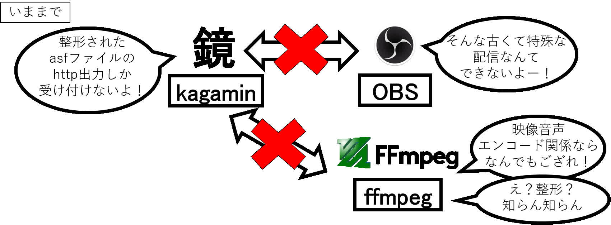

# tsukasa-OBS.bat

tsukasaをOBSで使うときにもう少し便利になるかもしれないバッチファイル

個人的に使っていただけのバッチファイルを外向けにちょっと整形だけしたやつ

通常は、
> kagaminでpush待機→tsukasa起動→OBSで配信開始

の3手順が必要ですが、

これを使うと、これが`push待機＋tsukasa起動`をしてくれるので、
> tsukasa-OBS.batダブルクリック→OBSで配信開始

だけで済むようになります。

# 必要なもの

- tsukasa入りffmpeg  
つかさ配布所<small>(直リンクはしませんので探してください)</small>のtsukasa-4.2.1.zip  
もしくは、[tsukasa単体](https://github.com/shinji3/tsukasa.exe)及び[ffmpeg](https://www.ffmpeg.org/)（分かる人向け）

- 置き場設定されているkagamin  
鏡置き場  
もしくは、鏡置き場を有効化した鏡（自鯖でやりたい人向け）

# 使い方

[ここから](https://github.com/meto4d/tsukasa-OBS.bat/releases)
をtsukasa-OBS.batをダウンロードし、tsukasa-4.2.1.zipを解答したフォルダの中へファイルを移動

ダウンロードしたファイルを`右クリック→編集`(windows10の場合)  

もしくは、メモ帳にドラッグアンドドロップし、設定項目を入力してください。

## 主に設定すべき項目
置き場から鏡を借りて配信する場合は、
- 置き場URL
- 借りるポート
- パスワード
- コメント

自鯖で配信する場合は、kagaminの鏡置き場モードの設定をして
- (kagaminの場所)
- 置き場URL
- 借りるポート

を設定

後はダブルクリックして実行し、OBSで配信開始するとできます

## 配信終了する時
OBSはもちろん、黒い文字だけの画面(tsukasaが動いてるやつ)とkagaminを終了すれば終わります

OBSだけだと、無限に接続待機したり、知らずにkagaminが動き続けるので、気をつけてください

## 他の設定
基本は鏡置き場を借りるときに出てくる設定項目（リザとか子リダイレクトとか）を設定できます

下の方にある`clip_f`の項を`set clip_f=TRUE`にすると借りる鏡URLがクリップボードにコピーされます

<b>鏡を借りる時に、すでに借りられている場合でも接続試行してしまい、接続失敗したまま動いてしまうので、  
そのポート番号は使えるかどうかはきちんと確認してください。</b>

`tsukasa-OBS_old.bat`はffmpegとtsukasaが別々になっている古い方で使えるやつです

デフォはShift-JISですが、念の為UTF-8版も用意したので、必要な方をDLしてください

# よく聞かれたこと
tsukasaとかこれとかなんぞやを、なるべく簡単に説明(一部語弊あり)  

tsukasa(S2MMSH)登場前  

tsukasa(S2MMSH)登場後  

このtsukasa-OBS.bat  

# その他

一部デバッグしてません  

なんかあればdiscordかtwitterかプルリクで

